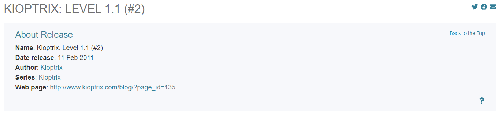
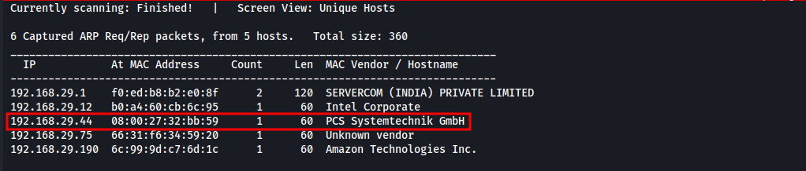

# Kioptrix Level 2 Walkthrough



## Introduction

**Platform:** Vulnhub  
**Difficulty Level:** Easy  
**IP Address/Target URL:** 192.168.29.44  
**Date:** 04-09-2024  
**Objective:** The Kioptrix VM series offers a set of challenges designed to teach vulnerability assessment and exploitation techniques. The goal is to gain root access on the machine using any method available. These challenges help in mastering basic tools and techniques in penetration testing.

## Enumeration

### Initial Reconnaissance

**Tools Used:** Netdiscover, Nmap

#### Network Discovery with Netdiscover

To identify the target IP, I used Netdiscover:

```bash
netdiscover -i eth0 -r 192.168.29.1/24
```


